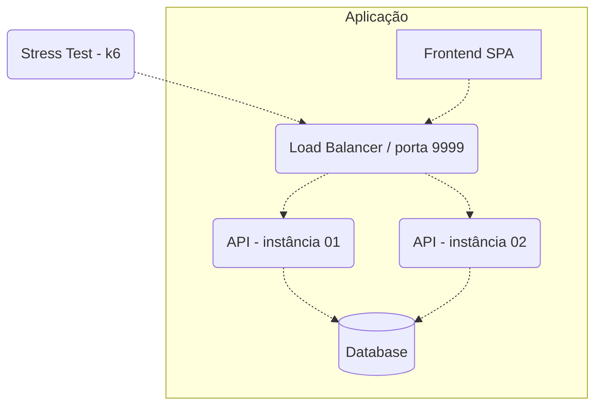

# Arena do Código 2025/Q2: Sistema de Venda de Ingressos


## [Participe do Evento ao Vivo em 15/07/2025!](https://youtube.com/live/arena2025)

A Arena do Código é um desafio técnico que tem como principal objetivo compartilhar c- **API (2 instâncias)**: Backend que processa as requisições HTTP.
   - Deve implementar todos os endpoints especificados.
   - Deve ser implementado com tecnologias de sua escolha.
   - **Deve estar acessível em http://localhost:5000**

3. **Banco de Dados**: Persistência para clientes, eventos e compras.
   - Pode ser SQL ou NoSQL.
   - *Não é permitido uso exclusivo* de bancos de dados puramente em memória como Redis.
   - Redis ou tecnologias similares podem ser usadas como cache complementar.

4. **Frontend**: Interface do usuário para interação.
   - Deve ser servido como um container separado.
   - **Deve estar acessível em http://localhost:3000** em formato de competição! Esta é a primeira edição de 2025, com um tema desafiador que vai testar suas habilidades em concorrência, escalabilidade e desenvolvimento fullstack.

A data limite para enviar sua submissão é **30 de Junho de 2025 às 23:59:59 (UTC-3)** e os resultados serão anunciados em **15 de Julho de 2025 às 19:00** [numa live](https://youtube.com/live/arena2025) no YouTube.

O tema principal desta Arena é o desenvolvimento de um **Sistema de Venda de Ingressos para Eventos**, com foco em controle de concorrência, performance sob carga e experiência de usuário.

## Introdução ao Desafio

O Sistema de Venda de Ingressos deve permitir a criação de eventos, cadastro de clientes e compra de ingressos. A principal complexidade está no controle transacional das vendas, garantindo consistência nos dados mesmo sob alta carga concorrente.

Diferente de edições anteriores de desafios técnicos, esta Arena exige tanto o desenvolvimento backend quanto frontend, proporcionando uma experiência end-to-end completa.

## O Que Precisa Ser Feito?

Para participar você precisa desenvolver:

1. Uma API HTTP com os endpoints especificados abaixo
2. Uma interface web que consuma esta API
3. Um ambiente Docker que rode a solução completa

### API Backend

#### Endpoints Obrigatórios:

##### 1. Criação de Cliente
**Requisição**

`POST /clientes`
```json
{
    "nome": "Nome do Cliente",
    "email": "email@exemplo.com",
    "cpf": "12345678900"
}
```

**Resposta**

`HTTP 201 Created`
```json
{
    "id": "550e8400-e29b-41d4-a716-446655440000",
    "nome": "Nome do Cliente",
    "email": "email@exemplo.com",
    "cpf": "12345678900"
}
```

##### 2. Criação de Evento
**Requisição**

`POST /eventos`
```json
{
    "nome": "Show de Rock",
    "data": "2025-08-15T20:00:00Z",
    "capacidade": 100,
    "preco": 5000
}
```
Onde:
- `nome` é o nome do evento
- `data` é a data/hora do evento em formato ISO 8601
- `capacidade` é a quantidade total de ingressos disponíveis
- `preco` é o valor em centavos (5000 = R$ 50,00)

**Resposta**

`HTTP 201 Created`
```json
{
    "id": "550e8400-e29b-41d4-a716-446655440001",
    "nome": "Show de Rock",
    "data": "2025-08-15T20:00:00Z",
    "capacidade": 100,
    "preco": 5000,
    "ingressos_vendidos": 0,
    "ingressos_disponiveis": 100
}
```

##### 3. Compra de Ingresso
**Requisição**

`POST /compras`
```json
{
    "cliente_id": "550e8400-e29b-41d4-a716-446655440000",
    "evento_id": "550e8400-e29b-41d4-a716-446655440001"
}
```

**Resposta**

`HTTP 201 Created`
```json
{
    "id": "550e8400-e29b-41d4-a716-446655440002",
    "cliente_id": "550e8400-e29b-41d4-a716-446655440000",
    "evento_id": "550e8400-e29b-41d4-a716-446655440001",
    "valor": 5000,
    "data_compra": "2025-06-10T14:30:25Z",
    "status": "confirmada"
}
```

##### 4. Consulta de Evento
**Requisição**

`GET /eventos/:id`

**Resposta**

`HTTP 200 OK`
```json
{
    "id": "550e8400-e29b-41d4-a716-446655440001",
    "nome": "Show de Rock",
    "data": "2025-08-15T20:00:00Z",
    "capacidade": 100,
    "preco": 5000,
    "ingressos_vendidos": 42,
    "ingressos_disponiveis": 58,
    "status": "disponivel"
}
```

Onde `status` pode ser:
- `disponivel` - ainda há ingressos disponíveis
- `esgotado` - não há mais ingressos disponíveis

##### 5. Consulta de Cliente e suas Compras
**Requisição**

`GET /clientes/:id`

**Resposta**

`HTTP 200 OK`
```json
{
    "id": "550e8400-e29b-41d4-a716-446655440000",
    "nome": "Nome do Cliente",
    "email": "email@exemplo.com",
    "compras": [
        {
            "id": "550e8400-e29b-41d4-a716-446655440002",
            "evento_id": "550e8400-e29b-41d4-a716-446655440001",
            "evento_nome": "Show de Rock",
            "valor": 5000,
            "data_compra": "2025-06-10T14:30:25Z",
            "status": "confirmada"
        }
    ]
}
```

##### 6. Listagem de Compras
**Requisição**

`GET /compras?limite=10&pagina=1`

**Resposta**

`HTTP 200 OK`
```json
{
    "total": 42,
    "pagina": 1,
    "limite": 10,
    "compras": [
        {
            "id": "550e8400-e29b-41d4-a716-446655440002",
            "cliente": {
                "id": "550e8400-e29b-41d4-a716-446655440000",
                "nome": "Nome do Cliente"
            },
            "evento": {
                "id": "550e8400-e29b-41d4-a716-446655440001",
                "nome": "Show de Rock"
            },
            "valor": 5000,
            "data_compra": "2025-06-10T14:30:25Z"
        },
        // ...
    ]
}
```

### Regras de Negócio

1. **Limite por Cliente**: Cada cliente só pode comprar **1 ingresso por evento**.
   - Se tentar comprar novamente, deve retornar erro HTTP 409 Conflict.

2. **Controle de Estoque**: Não pode haver overbooking (mais ingressos vendidos do que disponíveis).
   - Se não houver ingressos disponíveis, deve retornar erro HTTP 422 Unprocessable Entity.

3. **Transações Atômicas**: A operação de compra deve ser **atômica e segura sob concorrência**.
   - Isso é especialmente importante quando vários clientes tentam comprar os últimos ingressos simultaneamente.

4. **Validação de Input**:
   - Todos os campos são obrigatórios.
   - CPF deve ser um número válido (apenas dígitos).
   - Email deve ter formato válido.
   - Preço e capacidade devem ser valores positivos.

5. **Tratamento de Erros**:
   - Erros de validação: HTTP 400 Bad Request
   - Recursos não encontrados: HTTP 404 Not Found
   - Conflitos de regra de negócio: HTTP 409 Conflict ou 422 Unprocessable Entity

### Interface Frontend

A interface do usuário deve ser uma Single Page Application (SPA) que consuma a API desenvolvida e ofereça, no mínimo, as seguintes páginas:

#### 1. Página de Eventos
- Listagem de eventos disponíveis
- Indicação visual de disponibilidade (disponível/esgotado)
- Filtragem por data ou status

#### 2. Página de Detalhe do Evento
- Informações completas do evento
- Contador de ingressos disponíveis/vendidos (atualizado em tempo real)
- Botão de compra de ingresso
- Formulário para criar conta ou fazer login antes da compra

#### 3. Página de Cliente
- Dados do cliente
- Histórico de compras de ingressos
- Status das compras

#### 4. Página de Feed de Compras
- Lista de compras recentes em tempo real
- Informações de cliente e evento
- Atualizações automáticas quando novas compras são feitas

### Requisitos Técnicos Frontend

- Uso de React, Vue, Angular ou framework similar
- Design responsivo (mobile-first)
- Atualização em tempo real via WebSockets ou polling
- Feedback visual durante operações (loading states)
- Tratamento adequado de erros
- Interface intuitiva e moderna

## Arquitetura da Solução

A solução deve ser entregue como um conjunto de containers Docker, seguindo a arquitetura mínima abaixo:



### Componentes Obrigatórios:

1. **Load Balancer**: Distribuição de carga entre as instâncias da API (ex: Nginx, HAProxy).
   - Deve escutar na porta 9999 para receber testes de carga.
   - Algoritmo de distribuição: round-robin.

2. **API (2 instâncias)**: Backend que processa as requisições HTTP.
   - Deve implementar todos os endpoints especificados.
   - Deve ser implementado com tecnologias de sua escolha.

3. **Banco de Dados**: Persistência para clientes, eventos e compras.
   - Pode ser SQL ou NoSQL.
   - *Não é permitido uso exclusivo* de bancos de dados puramente em memória como Redis.
   - Redis ou tecnologias similares podem ser usadas como cache complementar.

4. **Frontend**: Interface do usuário para interação.
   - Deve ser servido como um container separado.

## Restrições do Ambiente

A aplicação completa deve funcionar com as seguintes restrições:

- **CPU**: 1.5 unidades de CPU distribuídas entre todos os serviços
- **Memória**: 550MB distribuídos entre todos os serviços

Todos os serviços precisam ter seus limites explicitamente declarados no `docker-compose.yml`.

Exemplo de configuração de restrições:

```yml
services:
  api01:
    # ...configurações...
    deploy:
      resources:
        limits:
          cpus: "0.4"
          memory: "120MB"
  
  api02:
    # ...configurações...
    deploy:
      resources:
        limits:
          cpus: "0.4"
          memory: "120MB"
  
  nginx:
    # ...configurações...
    deploy:
      resources:
        limits:
          cpus: "0.1"
          memory: "10MB"
  
  db:
    # ...configurações...
    deploy:
      resources:
        limits:
          cpus: "0.5"
          memory: "240MB"

  frontend:
    # ...configurações...
    deploy:
      resources:
        limits:
          cpus: "0.1"
          memory: "60MB"
```

**Importante**: A soma dos limites não pode ultrapassar 1.5 CPUs e 550MB de memória!

### Infraestrutura e Liberdades Técnicas

Você tem total liberdade para escolher qualquer tecnologia ou arquitetura interna, desde que:

1. Toda a solução esteja contida em um único arquivo `docker-compose.yml`
2. As restrições de recursos (CPU e memória) sejam respeitadas
3. As portas especificadas (backend: 5000, frontend: 3000) estejam corretamente expostas
4. Os requisitos funcionais sejam atendidos

É permitido o uso de:
- Qualquer linguagem de programação
- Qualquer framework web
- Qualquer banco de dados
- Serviços adicionais (caches, message brokers, etc.)
- Estratégias de otimização (CDNs, compressão, etc.)

O importante é que a solução funcione conforme especificado dentro das restrições de recursos.

## Processo de Submissão

Para participar, você deve fazer um pull request neste repositório incluindo um subdiretório em `participantes` com os seguintes arquivos:

- `docker-compose.yml` - configuração dos serviços com restrições de recursos
- `README.md` - incluindo seu nome/equipe, tecnologias utilizadas, link para repositório do código-fonte, e informações de contato
- Scripts de inicialização, configurações e quaisquer outros arquivos necessários para o funcionamento do projeto

Exemplo de estrutura:
```
├─ participantes/
|  ├─ equipe-campeoes/
|  |  ├─ docker-compose.yml
|  |  ├─ nginx.conf
|  |  ├─ scripts/
|  |  |  ├─ init.sql
|  |  ├─ README.md
```

### Requisitos Obrigatórios para Submissão

1. **Imagens Docker públicas**: Todas as imagens declaradas no `docker-compose.yml` devem estar disponíveis publicamente (ex: Docker Hub).
2. **Repositório público**: O código fonte completo deve estar em um repositório público do GitHub e linkado no README.md.
3. **Script de inicialização**: Deve ser fornecido um script para inicializar o banco de dados com dados para teste.
4. **Documentação**: README.md com instruções claras de como a aplicação funciona e como foi implementada.

## Testes da Solução

### Testes de Carga no Backend

A aplicação será testada utilizando o [k6](https://k6.io/) com cenários que simularão:

1. Alta carga de consultas simultâneas aos eventos
2. Múltiplas tentativas de compras simultâneas do mesmo ingresso
3. Verificação de consistência de dados após testes de concorrência

O script de teste está disponível em [load-test](./load-test) para que você possa testar sua aplicação durante o desenvolvimento.

#### Como executar os testes de carga

```bash
# Instale o k6 conforme documentação: https://k6.io/docs/getting-started/installation/
# Execute os testes
k6 run ./load-test/scenarios.js
```

### Testes de Performance do Frontend

O frontend será testado automaticamente utilizando o Lighthouse CI para avaliar:

1. First Contentful Paint (FCP)
2. Largest Contentful Paint (LCP)
3. Cumulative Layout Shift (CLS)
4. First Input Delay (FID) / Total Blocking Time (TBT)
5. Time to Interactive (TTI)

#### Como executar os testes de performance

```bash
# Instale o Lighthouse CI
npm install -g @lhci/cli

# Execute os testes
lhci autorun --collect.url=http://localhost:3000
```

Os resultados dos testes serão considerados na avaliação final, com pontuações mínimas esperadas:
- Performance: 80+
- Accessibility: 90+
- Best Practices: 85+
- SEO: 90+

## Critérios de Avaliação

A avaliação será feita com base nos seguintes critérios:

1. **Conformidade Funcional** (30%)
   - Implementação correta de todas as funcionalidades especificadas
   - Aderência às regras de negócio

2. **Performance e Escalabilidade** (30%)
   - Throughput (requisições/segundo)
   - Latência p95/p99
   - Comportamento sob carga

3. **Consistência de Dados** (20%)
   - Corretitude das operações concorrentes
   - Ausência de race conditions
   - Integridade das informações

4. **Frontend e UX** (15%)
   - Design e responsividade
   - Funcionalidade em tempo real
   - Tratamento de erros e estados
   - First Contentful Paint (FCP) e métricas de desempenho
   - Pontuação no PageSpeed Insights (ou métricas similares)

5. **Código e Arquitetura** (5%)
   - Clareza e organização
   - Escolhas técnicas
   - Documentação

## Dados Iniciais

Para fins de teste, o banco de dados deve ser inicializado com pelo menos:

- 5 clientes com IDs pré-definidos
- 5 eventos com diferentes capacidades e preços
- Pelo menos um evento deve estar com 90% dos ingressos vendidos para teste de concorrência na compra dos últimos ingressos

## Regras da Competição

- **Prazo**: 48 horas a partir do anúncio oficial
- **Equipes**: Individual ou em grupos de até 3 pessoas
- **Submissões**: Uma submissão por pessoa/equipe
- **Avaliação**: Os resultados serão divulgados em live no YouTube
- **Código Aberto**: Todo o código deve ser disponibilizado publicamente

## FAQ

**Q: Posso usar qualquer linguagem ou framework?**
A: Sim, você tem total liberdade para escolher as tecnologias mais adequadas, desde que atenda aos requisitos e restrições de recursos.

**Q: É necessário implementar autenticação?**
A: Não é necessário.

**Q: Como será testado se minha aplicação atende aos requisitos de atualização em tempo real?**
A: Serão realizadas compras simultâneas e verificado se a interface se atualiza em tempo hábil sem necessidade de refresh manual.

**Q: O que acontece se minha aplicação exceder os limites de CPU/memória?**
A: Será desclassificada se não conseguir operar dentro dos limites estabelecidos.

---

Boa sorte e divirta-se construindo sua solução! Estamos ansiosos para ver as diversas implementações e aprender com a comunidade.

Para dúvidas ou esclarecimentos: [arenadocodigo2025@exemplo.com](mailto:arenadocodigo2025@exemplo.com)
