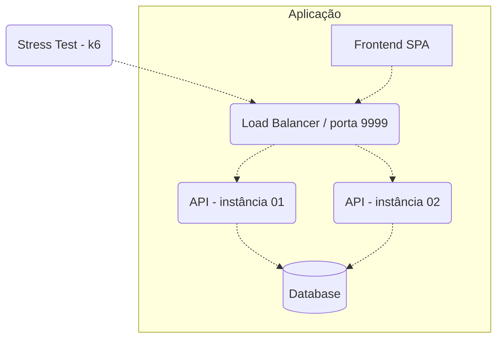

# Arena do Código 2025/Q2: Sistema de Venda de Ingressos


## [Participe do Evento ao Vivo em 15/07/2025!](https://youtube.com/live/arena2025)

A Arena do Código é um desafio técnico que promove conhecimento através de competição! Nesta primeira edição de 2025, desafiamos você a construir um sistema completo de venda de ingressos para eventos.

**Prazo de submissão:** 30 de Junho de 2025 às 23:59:59 (UTC-3)  
**Divulgação dos resultados:** 15 de Julho de 2025 às 19:00 [em live](https://youtube.com/live/arena2025)

## Introdução ao Desafio

Imagine um cenário de alto estresse: ingressos para shows esgotam em minutos, com milhares de fãs tentando comprar simultaneamente. Como garantir que o sistema não venda mais ingressos do que existem? Como evitar que clientes comprem o mesmo ingresso? Como manter a experiência fluida mesmo sob carga extrema?

Este é seu desafio: construir um sistema de venda de ingressos **resistente à concorrência** e **escalável**, que:

1. Garanta atomicidade nas transações de compra (sem overselling)
2. Ofereça uma interface administrativa em tempo real
3. Seja capaz de lidar com picos de carga
4. Mantenha a consistência dos dados mesmo sob alto tráfego

Diferente de desafios anteriores, este exige competências tanto em backend (performance, concorrência, escalabilidade) quanto em frontend (experiência em tempo real, responsividade, métricas de desempenho).

## Especificações Técnicas

### API Backend

##### 1. Compra de Ingresso
**Requisição**

`POST /compras`
```json
{
    "cliente_id": "550e8400-e29b-41d4-a716-446655440000",
    "evento_id": "550e8400-e29b-41d4-a716-446655440001"
}
```

**Resposta**

`HTTP 201 Created`
```json
{
    "id": "550e8400-e29b-41d4-a716-446655440002",
    "cliente_id": "550e8400-e29b-41d4-a716-446655440000",
    "evento_id": "550e8400-e29b-41d4-a716-446655440001",
    "valor": 5000,
    "data_compra": "2025-06-10T14:30:25Z",
    "status": "confirmada"
}
```

##### 2. Consulta de Evento
**Requisição**

`GET /eventos/:id`

**Resposta**

`HTTP 200 OK`
```json
{
    "id": "550e8400-e29b-41d4-a716-446655440001",
    "nome": "Show de Rock",
    "data": "2025-08-15T20:00:00Z",
    "capacidade": 100,
    "preco": 5000,
    "ingressos_vendidos": 42,
    "ingressos_disponiveis": 58,
    "status": "disponivel"
}
```

Onde `status` pode ser:
- `disponivel` - ainda há ingressos disponíveis
- `esgotado` - não há mais ingressos disponíveis

##### 3. Consulta de Cliente e suas Compras
**Requisição**

`GET /clientes/:id`

**Resposta**

`HTTP 200 OK`
```json
{
    "id": "550e8400-e29b-41d4-a716-446655440000",
    "nome": "Nome do Cliente",
    "email": "email@exemplo.com",
    "compras": [
        {
            "id": "550e8400-e29b-41d4-a716-446655440002",
            "evento_id": "550e8400-e29b-41d4-a716-446655440001",
            "evento_nome": "Show de Rock",
            "valor": 5000,
            "data_compra": "2025-06-10T14:30:25Z",
            "status": "confirmada"
        }
    ]
}
```

##### 4. Listagem de Compras
**Requisição**

`GET /compras?limite=10&pagina=1`

**Resposta**

`HTTP 200 OK`
```json
{
    "total": 42,
    "pagina": 1,
    "limite": 10,
    "compras": [
        {
            "id": "550e8400-e29b-41d4-a716-446655440002",
            "cliente": {
                "id": "550e8400-e29b-41d4-a716-446655440000",
                "nome": "Nome do Cliente"
            },
            "evento": {
                "id": "550e8400-e29b-41d4-a716-446655440001",
                "nome": "Show de Rock"
            },
            "valor": 5000,
            "data_compra": "2025-06-10T14:30:25Z"
        },
        // ...
    ]
}
```

## Modelo de Acesso e Regras de Negócio

### Usuários e Papéis

O sistema tem dois tipos de usuários:

| Usuário | Interface | Função |
|---------|-----------|--------|
| **Cliente** | Acesso via API (sem interface web) | Cadastrar-se, comprar ingressos, ver histórico |
| **Admin** | Interface web administrativa | Gerenciar eventos, monitorar compras em tempo real |

### Consumidores por Endpoint

| Endpoint | Método | Consumidor | Descrição |
|----------|--------|------------|-----------|
| `/compras` | POST | API (cliente) | Compra de ingressos |
| `/eventos/:id` | GET | Ambos | Consulta de eventos |
| `/clientes/:id` | GET | API (cliente) | Histórico de compras |
| `/compras` | GET | Admin (via frontend) | Monitoramento em tempo real |

### Regras Críticas

1. **Uma compra por cliente**: Cada cliente (identificado pelo GUID fornecido) pode comprar apenas 1 ingresso por evento
2. **Sem overselling**: O sistema deve garantir que nunca sejam vendidos mais ingressos que o disponível para o evento (identificado pelo GUID fornecido)
3. **Operações atômicas**: As compras devem ser seguras sob concorrência 
4. **Atualizações em tempo real**: O painel administrativo deve mostrar compras instantaneamente

### Interface Administrativa

A interface administrativa deve ser uma SPA com:

- **Dashboard de eventos**: Lista, status, estatísticas
- **Detalhes do evento**: Contador em tempo real de ingressos disponíveis/vendidos
- **Gestão de clientes**: Visualização de histórico de compras
- **Feed de atividades**: Atualizações em tempo real das compras

### Requisitos Técnicos do Frontend

- Framework moderno (React, Vue, Angular)
- Design responsivo e mobile-first
- Atualizações em tempo real
- Métricas de desempenho (FCP, LCP, CLS)
- Tratamento adequado de erros e estados de carregamento

## Requisitos Técnicos

### Arquitetura



### Componentes e Portas

| Componente | Descrição | Porta |
|------------|-----------|-------|
| **Load Balancer** | Round-robin entre instâncias | 9999 (testes) |
| **API (2 instâncias)** | Processa requisições HTTP | 5000 |
| **Banco de Dados** | Persistência (SQL ou NoSQL) | - |
| **Frontend** | Interface administrativa | 3000 |

### Restrições de Recursos

- **CPU Total**: 1.5 unidades
- **Memória Total**: 550MB
- Todos os limites devem ser declarados no `docker-compose.yml`

```yml
services:
  api01:
    # ...
    deploy:
      resources:
        limits:
          cpus: "0.4"
          memory: "120MB"
  # ... outros serviços com limites
```

### Liberdades Técnicas

Você pode escolher:
- Linguagens de programação
- Frameworks
- Banco de dados (exceto soluções puramente em memória)
- Arquitetura interna
- Mecanismos de comunicação em tempo real

Desde que:
- Tudo esteja em um único `docker-compose.yml`
- Respeite as restrições de recursos
- Exponha as APIs nas portas especificadas
- Atenda aos requisitos funcionais

## Processo de Submissão

Para participar, você deve fazer um pull request neste repositório incluindo um subdiretório em `participantes` com os seguintes arquivos:

- `docker-compose.yml` - configuração dos serviços com restrições de recursos
- `README.md` - incluindo seu nome/equipe, tecnologias utilizadas, link para repositório do código-fonte, e informações de contato
- Scripts de inicialização, configurações e quaisquer outros arquivos necessários para o funcionamento do projeto

Exemplo de estrutura:
```
├─ participantes/
|  ├─ equipe-campeoes/
|  |  ├─ docker-compose.yml
|  |  ├─ nginx.conf
|  |  ├─ scripts/
|  |  |  ├─ init.sql
|  |  ├─ README.md
```

### Requisitos Obrigatórios para Submissão

1. **Imagens Docker públicas**: Todas as imagens declaradas no `docker-compose.yml` devem estar disponíveis publicamente (ex: Docker Hub).
2. **Repositório público**: O código fonte completo deve estar em um repositório público do GitHub e linkado no README.md.
3. **Script de inicialização**: Deve ser fornecido um script para inicializar o banco de dados que carregue os eventos do arquivo CSV fornecido.
4. **Documentação**: README.md com instruções claras de como a aplicação funciona e como foi implementada.

## Avaliação e Testes

### Critérios de Avaliação

| Critério | Peso | Aspectos Avaliados |
|----------|------|-------------------|
| **Conformidade Funcional** | 30% | Funcionalidades corretas, regras de negócio |
| **Performance e Escalabilidade** | 30% | Throughput, latência p95/p99, comportamento sob carga |
| **Consistência de Dados** | 20% | Operações concorrentes, ausência de race conditions |
| **Frontend e UX** | 15% | Design, tempo real, métricas de desempenho |
| **Código e Arquitetura** | 5% | Organização, escolhas técnicas, documentação |

### Testes Automatizados

#### Backend (k6)
```bash
# Simula alta concorrência na compra de ingressos
k6 run ./load-test/scenarios.js
```

#### Frontend (Lighthouse)
```bash
# Avalia métricas de performance web
lhci autorun --collect.url=http://localhost:3000
```

**Pontuação mínima esperada:**
- Performance: 80+
- Accessibility: 90+
- Best Practices: 85+

### Dados para Teste

Um arquivo `eventos.csv` com dados iniciais dos eventos está disponível no repositório. Este arquivo contém:
- 3 eventos com diferentes capacidades e preços
- Um deles (Concerto de Jazz) já está com 90% de ocupação para testar cenários de concorrência

Durante os testes, serão fornecidos:
- GUIDs aleatórios para clientes
- Os eventos e seus dados são fornecidos no arquivo CSV

## Submissão e Regras

### Como Participar

1. Faça fork do repositório
2. Implemente sua solução
3. Submeta um PR com sua estrutura em `/participantes/seu-nome/`
4. Inclua os arquivos obrigatórios (docker-compose.yml, README.md, scripts)

### Formato da Submissão
```
├─ participantes/
|  ├─ equipe-campeoes/
|  |  ├─ docker-compose.yml
|  |  ├─ nginx.conf
|  |  ├─ scripts/
|  |  ├─ README.md
```

### Regras
- **Prazo**: 48 horas
- **Equipes**: Individual ou até 3 pessoas
- **Código**: Totalmente aberto no GitHub
- **Imagens Docker**: Disponíveis publicamente

## FAQ

**Q: Posso usar qualquer tecnologia?**  
A: Sim, desde que respeite os requisitos e limites de recursos.

**Q: Preciso implementar autenticação?**  
A: Não é necessário.

**Q: Preciso criar endpoints para cadastro de eventos e clientes?**  
A: Não é necessário criar endpoints para cadastro. Os eventos devem ser carregados do arquivo CSV fornecido e para clientes usaremos GUIDs aleatórios durante os testes.

**Q: Como são testadas as atualizações em tempo real?**  
A: Com compras simultâneas verificando se a interface se atualiza sem refresh manual.

---

Boa sorte! Estamos ansiosos para ver sua solução inovadora.

[arenadocodigo2025@exemplo.com](mailto:arenadocodigo2025@exemplo.com)
